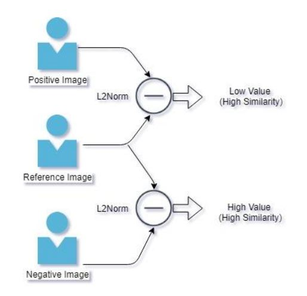

# face-watcher

This repository contains end to end implementation of Face Recognition using FaceNet and MTCNN

### Requirements

1. Need Mongo DB Instance (Used here to store 128 D face embeddings)

### Usage

1. Installation: pip install -r requirements.txt
2. uvicorn main:app --reload

### Description

- Facial Verification system is a system where by just inputing a the image of the person its identity
  can be extracted
- System captures image of a person, recognizes and extract faces and then
  generate a 128 D vector embedding (feature vector),
- A similarity score is than calculated with the reference image, the score is then compared with a threshold and then the person is identified.
- Here for calculation of Similarity score FAISS (Facebook AI Similarity Search) library is used
- Faiss is built around an index type that stores a set of vectors, and provides a function to search in them with L2 and/or dot product vector comparison.

### Architecture

Facial recognition deals with two major tasks:

1. Face Localization
2. Face Identification

Face Localization deals with identifying where the focused face is located by outputting the bounding box coordinates of the face whereas Face Identification is identifying the identity of the person by calculate similarity score (difference in the distance between 2 vectors in Euclidean Space) with the known image (L2Norm). This entire process used in face Recognition is called as One-Shot Learning or Siamese Network which is based on idea that “Faces of a same person will have high similarity and the faces of different person will have very less similarity”.

Comparing the L2Norm values with a predefined threshold can provide the identity linked to the 128 D embedding value of the reference Image.

### Results

FastAPI for Python is being used to create API which outputs the identity. 

#### Sample Input /Output of Recognize Face:
##### Input:
  Image through web cam or via upload
  
##### Output:
  {
    "Prediction": "Anukool",
    "L2Distance": 0.5359955430030823
  }
  
 
